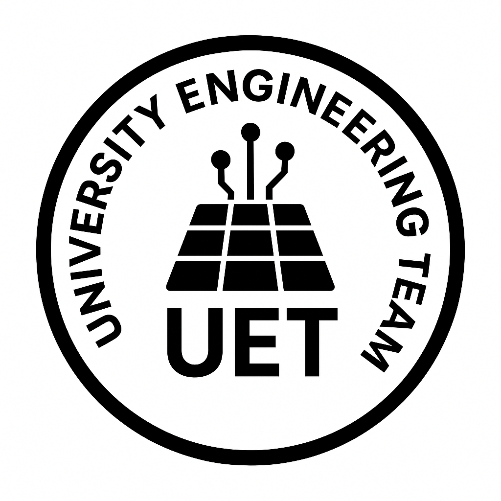

# Project "Helios" ☀️

**An Intelligent Combined Heat & Power (CHP) Microgrid Based on a Stirling Engine Thermal Cascade**  
**Developed by [UET (University Engineering Team)](https://www.linkedin.com/in/uet-university-engineering-team-aa9005392)**

   

## 📖 Executive Summary
Project **"Helios"** is a multidisciplinary engineering prototype designed to demonstrate a fully autonomous, instrumented Combined Heat and Power (CHP) microgrid. 

The core physical concept relies on a **thermal cascade**: a primary heat source powers a High-Temperature (HT) Stirling Engine, whose waste heat is captured and transferred through a **custom-machined aluminum block** attached to the HT engine's radiators. A Medium-Temperature (MT) Stirling Engine sits directly on top of this block to capture the rising heat, while Low-Temperature Thermoelectric Generators (TEGs) are mounted on the sides to convert the final-stage waste heat into electricity.

Beyond the physical hardware, "Helios" serves as a comprehensive platform integrating IoT sensor data pipelines, a live 3D Digital Twin, Cloud Infrastructure, and a FinTech venture model. All project results and the live portal can be viewed at: **[https://gethelios.online/](https://gethelios.online/)**

## ⚠️ Real-World Results & Engineering Honesty
In engineering, negative results are as valuable as positive ones. We want to be completely transparent about the physical performance of the Helios prototype:

**✅ The Successes:**
* **Thermodynamics Proven:** The principle of the thermal cascade worked. Real-time temperature sensors successfully proved the transfer of heat across all three stages (HT ➡️ Aluminum Block ➡️ MT & TEGs).
* **Flawless Cyber-Physical Integration:** The electrical communication between sensors, the ESP32 microcontroller, and the Raspberry Pi was executed flawlessly. The logic enabled full autonomous operation with the push of a single button.
* **Digital & FinTech Excellence:** The website, 3D model, financial models, and tokenomics were calculated and deployed correctly, functioning exactly as intended.

**❌ The Bottleneck (Mechanical & Electrical Inefficiency):**
* As the Project Lead (Mykyta Skyba), this was my first mechanical engineering project, and I severely miscalculated the mechanical power output. 
* Our HT prototype outputted only 4V at 0.002A (yielding a mere ~8mW), far below the expected 5V at 0.01A (~50mW). The MT engine was structurally unreliable and lacked the necessary power.
* The biggest oversight was failing to physically test the engine torque beforehand. The real RPM fell short of the maximum expected by about 100 RPM. Even using a larger wheel radius with a 1:5 gear ratio (aiming for 500 RPM on the smaller motor), the torque was insufficient. Standard hobby DC motors require around ~3000 RPM for stable generation, which our setup couldn't achieve.
* Additionally, the TEGs did not receive a sufficient temperature delta to produce meaningful power, as our small cooling heatsinks were inadequate for heat dissipation.

**Conclusion:**
I take full responsibility for the mechanical miscalculations as Project Lead. I underestimated the complexity of mechanical power generation and will dedicate more time to studying mechanical engineering principles. However, **the rest of the team did an absolutely stellar job**, fulfilling their tasks completely according to the original plan.

## ⚙️ System Architecture

* **1. Mechanical-Thermal Subsystem:** 
  HT Stage (Primary heat) ➡️ Custom Aluminum Transfer Block ➡️ MT Stage (Top) & LT Stage (TEGs on sides).
* **2. Electrical Power Subsystem:** 
  DC hobby motors & TEGs ➡️ Schottky Diodes ➡️ MT3608 Boost Converter (5V) ➡️ 10,000mAh Power Bank.
* **3. Cyber-Physical & Digital Twin Subsystem:** 
  Sensors (RPM, Voltage, Temp) ➡️ ESP32 / Raspberry Pi 4 ➡️ **Google Firebase** ➡️ Live Web Portal ([gethelios.online](https://gethelios.online/)). The entire system is automated to launch via a single physical button.
* **4. FinTech & Economics:** 
  A complete 5-year financial model (LCOE & ESG) is ready and available at **[gethelios.online/finance](https://gethelios.online/finance)**. A Tokenomics whitepaper for a "Green Energy Certificate" token is drafted at **[gethelios.online/token](https://gethelios.online/token)** (Smart contract integration is the next planned step).

## 🗂️ Repository Structure

* **[📁 hardware/](./hardware/)** — Schematics, BOM, and physical integration photos.
* **[📁 software/](./software/)** — Edge processing scripts and data acquisition (ESP32/RPi).
* **[📁 digital_twin_web/](./digital_twin_web/)** — Web portal, 3D twin, Cloud deployment (CI/CD).
* **[📁 fintech_and_business/](./fintech_and_business/)** — Financial models, Tokenomics whitepaper, Pitch deck.
* **[📁 docs/](./docs/)** — Deep-dive engineering and architectural analysis.

## 👥 The Team ([UET - University Engineering Team](https://www.linkedin.com/in/uet-university-engineering-team-aa9005392))
This project was brought to life by a cross-functional, international team spanning the USA and Poland:

**Core Leadership & Engineering Division (Washington, D.C.)**
* **[Mykyta Skyba](https://www.linkedin.com/in/mykyta-skyba-677521339/)** – Project Lead, Lead Systems Architect & Integration Lead. *(Full integration of the system, thermodynamic analysis, and project vision)*
* **[David Matsievich](https://www.linkedin.com/in/david-matsievich-44ba97235/)** – Assistant Project Lead & MT Design Engineer. *(Assistant in project management, responsible for MT engine installation and structural design)*

**Digital Twin & Cloud Division (Poland)**
* **[Andrii Serdiuk](https://www.linkedin.com/in/andriiserdiukk/)** – IT Manager & DevOps Lead. *(Cloud infrastructure, CI/CD, deployment automation)*
* **[Marcel Marek](https://www.linkedin.com/in/marcelmarek/)** – AI Specialist. *(Digital Twin integration)*
* **[Szymon Pankiewicz](https://www.linkedin.com/in/szymon-pankiewicz/)** – Marketing & Designer. *(Visual identity, branding, UI/UX)*
* **[Michał Dąbrowski](https://www.linkedin.com/in/michal-dabrowski03/)** – Quality Assurance (QA). *(Functional testing, platform quality, documentation)*

**Finance, Market & Policy Analysis Division (Washington, D.C.)**
* **[Simon Rakhlin](https://www.linkedin.com/in/simon-rakhlin/)** – Lead Financial Analyst. *(5-year financial model, LCOE, Pitch Deck)*
* **[Andrey Berks](https://www.linkedin.com/in/andreyberks/)** – Quantitative & FinTech Analyst. *(Tokenomics Whitepaper, Algorithmic trading simulation)*
* **[Ava Amelio](https://www.linkedin.com/in/ava-amelio-b2ab09357/)** – Political Science Researcher. *(Large-scale production viability analysis considering political changes and energy policies)*

## 🛒 Detailed Bill of Materials (BOM)
The physical prototype was constructed using off-the-shelf components for a total cost of **~$424 USD**:

**Thermal Core (~$132)**
* High-Temperature (HT) Stirling Engine (Sunnytech SC02M) - $59.99
* Medium-Temperature (MT) Stirling Engine (Sunnytech LT001) - $39.99
* Thermoelectric Generators (5-Pack) - $17.75
* Denatured Alcohol Fuel (190 Proof) - $16.99
* Small Heatsinks (10-Pack) - $8.99
* Thermal Paste (1.8g) - $5.99

**Electrical System (~$64)**
* Anker Power Bank (PowerCore 10K, 10,000mAh) - $25.99
* Pre-Charger Boost Converter (MT3608) 5-Pack - $5.99
* DC Hobby Motors (Type 130) 4-Pack - $6.99
* Schottky Diodes (1N5817) 125-Pack - $5.99
* Breadboard & Jumper Wire Kit - $19.99

**Data Acquisition & Compute (~$110)**
* Microcontrollers (ESP32 / Arduino Nano Clones) - $9.99
* Voltage & Current Sensor (INA219) - $8.99
* K-Type Thermocouple Sensors (2) - $7.69
* MAX6675 Thermocouple Modules (2-Pack) - $8.00
* IR RPM Sensors (6-Pack) - $6.99
* Raspberry Pi 4 Model B (4GB RAM) - $60.00

**Hardware/Misc (~$80)**
* 3D Printer Filament (1kg PLA) - $19.99
* Additional structural materials & wiring

---
**Connect with us on LinkedIn: [UET (University Engineering Team)](https://www.linkedin.com/in/uet-university-engineering-team-aa9005392)**
