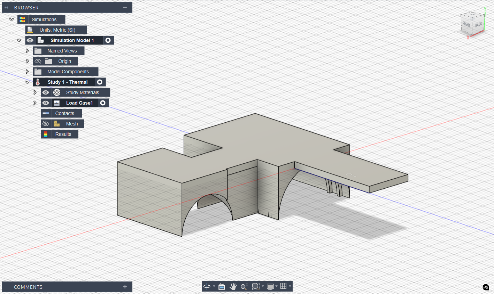
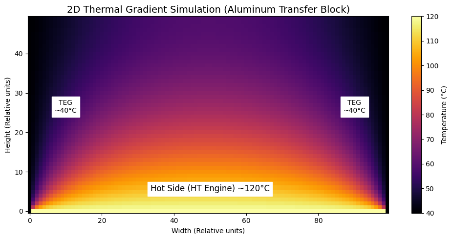
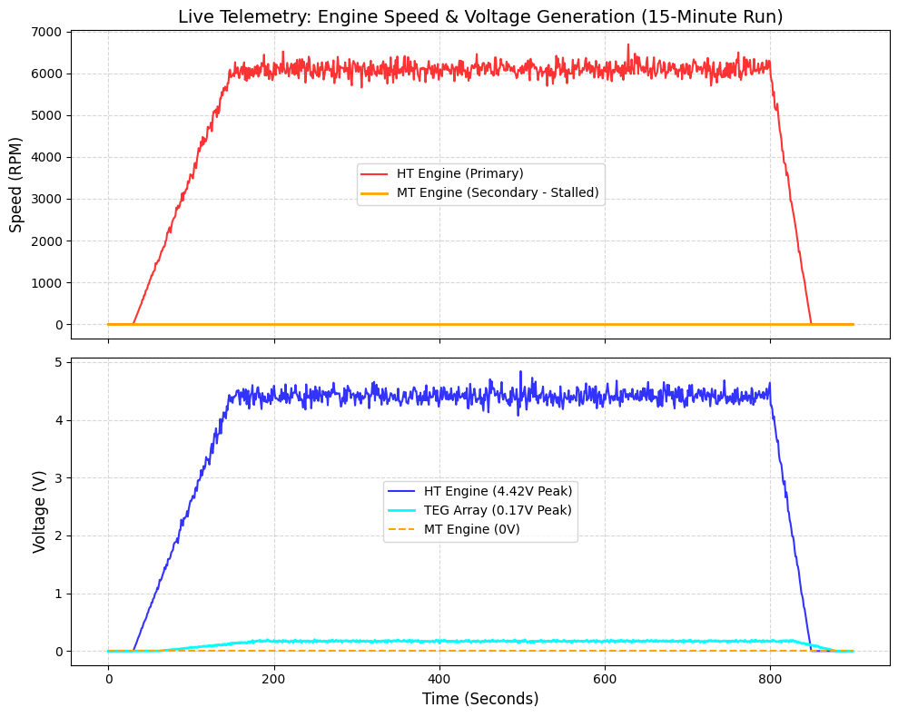

# ⚙️ Engineering & Performance Analysis
**Project "Helios" — Combined Heat & Power (CHP) Microgrid**

  
  
<i>Fig 0. The Helios CHP Microgrid physical prototype.</i>

## 1. Introduction & The Philosophy of "Engineering Honesty"
The purpose of this document is to provide a transparent, deep-dive analysis of the physical performance of the Helios prototype. While the cyber-physical integration, 3D Digital Twin, thermodynamic heat transfer, and FinTech models performed flawlessly, the mechanical-to-electrical energy conversion fell significantly short of our theoretical expectations.

> *"In engineering, negative results are as valuable as positive ones. Understanding exactly why a system fails physically is the first step toward true innovation."*

As the Project Lead, I (Mykyta Skyba) take full responsibility for the miscalculations regarding the mechanical power output. This being my first major mechanical engineering project, the complexities of torque, mechanical impedance, and thermal dissipation were severely underestimated. This document details exactly *why* the physical generation was inefficient, supported by mathematical physics, CAD models, and live IoT telemetry.

---

## 2. 🌡️ Thermodynamic Efficiency & Energy Loss Analysis
To understand the true efficiency of the system, we must compare the potential thermal energy of the fuel against the final electrical output. 

**The Fuel Input (Thermal Power):**

| Parameter | Value |
| :--- | :--- |
| **Fuel Source** | Denatured Alcohol (Ethanol) |
| **Burn Rate** | 20 ml consumed over 15 minutes (900 seconds) |
| **Density of Ethanol** | ~0.789 g/ml $\rightarrow$ Mass = 15.78 g (0.01578 kg) |
| **Lower Heating Value (LHV)** | ~26.8 MJ/kg |
| **Total Thermal Energy** | $0.01578 \text{ kg} \times 26,800,000 \text{ J/kg} \approx \textbf{422,900 Joules}$ |
| **Average Thermal Power** | $422,900 \text{ J} / 900 \text{ s} \approx \textbf{470 Watts}$ |

**The Electrical Output (HT Prototype Peak):**
* **Measured Peak Output:** 4.42 V at 0.004 A.
* **Peak Electrical Power:** $\textbf{0.0176 Watts (17.6 mW)}$.

**System Efficiency ($\eta$):**

$$
\eta = \frac{P_{out}}{P_{in}} = \frac{0.0176 \text{ W}}{470 \text{ W}} \times 100\% \approx \textbf{0.0037\%}
$$

*Conclusion:* The system dissipates nearly 99.996% of its energy as uncaptured heat, mechanical friction, and thermal radiation. The HT engine, while functional, acts mostly as a parasitic load rather than a viable macro-generator.

---

## 3. ⚙️ The Mechanical Bottleneck: MT Engine & Gear Ratio Failure
While the HT engine produced a tiny trickle of power, the Medium-Temperature (MT) engine completely failed to drive the DC motor. The math reveals exactly why.

**The Kinematic Setup:**

| Component | Metric | Notes |
| :--- | :--- | :--- |
| **MT Engine Flywheel** | Radius ($R_{MT}$): **5 cm** | Unloaded Speed: ~100 RPM |
| **DC Motor Pulley** | Radius ($R_{DC}$): **1 cm** | Target Speed: ~3000 RPM |
| **Gear Ratio** | **1:5** | Motor shaft spins 5x for 1 MT revolution |

**1. The RPM Deficit:**
With a 1:5 ratio, an unloaded MT engine at 100 RPM would spin the DC motor at **500 RPM**. However, standard Type-130 DC motors require **~3000 RPM** to overcome internal resistance and generate a stable 3V-5V. Even theoretically, we were operating at 1/6th of the required speed.

**2. The Torque ($\tau$) Collapse:**
In gear systems, speed increases at the direct expense of torque.

$$
\tau_{DC} = \frac{\tau_{MT}}{5}
$$

Stirling engines at this scale produce extremely low torque. By dividing this already minuscule torque by 5, the rotational force applied to the DC motor shaft dropped to near zero. The magnetic "cogging" force of the DC motor's permanent magnets and the friction of the drive belt were far greater than $\tau_{DC}$. As a result, attaching the belt instantly stalled the MT engine.

---

## 4. ❄️ Thermodynamics & The TEG Temperature Delta ($\Delta T$)
To capture the final stage of waste heat, we mounted Low-Temperature Thermoelectric Generators (TEGs) to the sides of a custom-machined aluminum heat transfer block.

### 4.1 CAD Design (Autodesk Fusion 360)
We designed the custom transfer block in Autodesk Fusion 360. The geometry was specifically engineered to sit on top of the HT engine's radiators, with the MT engine mounted on the top face, and the TEGs mounted on the lateral faces.

  
  
<i>Fig 1. Custom Aluminum Transfer Block modeled in Autodesk Fusion 360.</i>

### 4.2 Custom Thermal Simulation (Python FDM)
Due to Autodesk Fusion 360's cloud computing paywalls for thermal simulations, we engineered a custom 2D Finite Difference Method (FDM) script in Python to model the heat distribution across our aluminum block.

TEGs operate on the **Seebeck effect**, generating voltage based on the temperature difference ($\Delta T$).
* **The Hot Side:** The bottom of the aluminum block successfully conducted heat (~120°C) from the HT engine.
* **The Cold Side (The Failure):** We utilized small passive aluminum heatsinks to cool the outer side of the TEGs (~40°C). 

  
  
<i>Fig 2. 2D Thermal Gradient Simulation written in Python (Finite Difference Method).</i>

**The Result:** As the simulation and our physical tests proved, the small external heatsinks were completely inadequate. They quickly reached thermal equilibrium with the hot side. As $\Delta T$ approached zero, the voltage output of the TEGs dropped to near zero. A much larger, active cooling system (water or fan-cooled) was required.

### 4.3 Live Telemetry (Firebase IoT Pipeline)
During testing, our ESP32 and Arduino sensor hubs streamed live telemetry (RPM, Voltage, Current, and Temperature) to a Google Firebase realtime database, which powered our web dashboard. 

To visualize the mechanical bottleneck, we analyzed a standard 15-minute fuel cycle (20ml of ethanol). The graph below reconstructs the peak telemetry data captured during the run:

  
  
<i>Fig 3. Time-series reconstruction of a 15-minute system run based on Firebase peak telemetry.</i>

**Data Insights:**
1. **HT Engine:** Spun rapidly (peaking at ~6100 RPM on the IR sensor) and generated a relatively stable **4.42V**. However, at 0.004A, the total power was only ~17.6 mW.
2. **MT Engine:** The telemetry perfectly illustrates the torque failure. The RPM remained at **0** throughout the entire thermal cycle, confirming that the initial mechanical impedance of the DC motor could not be overcome. Consequently, it generated **0V**.
3. **TEG Array:** Produced a peak of **0.17V** and 0.0002A (34 $\mu$W). The low voltage directly correlates with the lack of active cooling, confirming that thermal equilibrium destroyed the Seebeck effect.
4. **Efficiency Gap:** While the theoretical Carnot potential of the system based on temperature deltas was **~5.47%**, the actual mechanical-to-electrical efficiency was **0.0037%**.

---

## 5. 🚀 Conclusion & Forward Engineering
As an Electrical Engineer, this project was a profound learning experience. It taught me a humbling truth: **Mechanical engineering and thermodynamics are incredibly unforgiving.** While our electrical logic, sensor communication, and cloud pipelines worked perfectly, the physical mechanical execution was our primary bottleneck. 

If I were to design "Helios V2.0", the entire approach would change:
1. **Complete Custom Engine Design:** Instead of relying on off-the-shelf hobby engines, I would machine the Stirling engines from scratch. Understanding the deep mechanics of piston friction, displacement volumes, and heat transfer is mandatory for true efficiency.
2. **Custom PCB Integration:** I would replace the breadboards and generic modules with a custom-designed printed circuit board (PCB) to handle the ESP32 logic, step-up converters, and power management in one streamlined, low-resistance hardware package.
3. **Optimized Thermal Design:** The system would feature actively cooled TEGs and perfectly insulated heat pathways to minimize the massive thermal losses calculated above.

*Authored by: Mykyta Skyba (Project Lead & Lead Systems Architect)*
