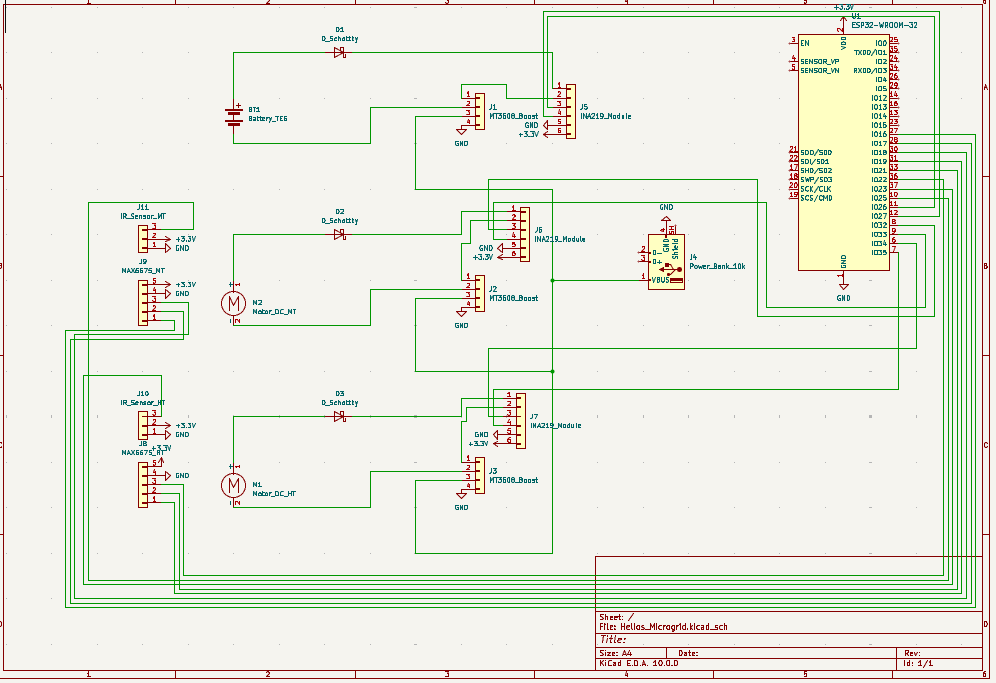

# 🛠️ Hardware Integration & Power Electronics
**Project "Helios" — Combined Heat & Power (CHP) Microgrid**

This directory contains the hardware documentation, electrical schematics, the complete Bill of Materials (BOM), and the microcontroller wiring architecture used to construct the Helios microgrid prototype.

## 1. System Architecture: Power & Data Flow
The physical hardware is divided into two distinct isolated circuits: the **Power Generation Chain** and the **Data Acquisition Hub**.

  <!-- Place your Altium / KiCad / Draw.io schematic image here -->
  
  
<i>Fig 1. System Block Diagram & Electrical Routing.</i>

### 🔌 The Power Generation Chain
To safely harvest unstable, low-voltage DC power from multiple mechanical sources, we engineered a consolidated charging bus:
1. **Generation:** DC Hobby Motors (attached to HT/MT engines) and the TEG array generate fluctuating DC voltage.
2. **Backflow Protection:** Each power-generating source is routed through a **1N5817 Schottky Diode**. This prevents the batteries or higher-voltage motors from driving current backwards into the stalled/lower-voltage motors (acting as a physical OR-gate).
3. **Conditioning:** The consolidated output is fed into an **MT3608 Boost Converter**, tuned to step up the low/fluctuating voltage to a stable **5.0V DC**.
4. **Storage:** The 5V output provides a continuous trickle-charge to the **10,000mAh Power Bank**, which serves as the grid's primary power reservoir.

---

## 2. 🧠 Edge Compute & Wiring Architecture
The local sensor hub runs on an **Arduino Nano** (with a transition plan to **ESP32** for V2.0). It processes raw sensor data, calculates thermodynamic efficiency limits in real-time, packages the data into a JSON payload, and transmits it via Serial to the Raspberry Pi Firebase Gateway.

### ⚠️ Engineering Flex: The I2C Multiplexing Hack
By default, standard INA219 modules ship with a hardcoded I2C address (`0x40`). Using four sensors (HT, MT, TEG, Total) on a single hardware I2C bus would cause immediate address collision. To solve this without physically desoldering SMD resistors on the modules, we engineered a software bypass:
* We assigned **one INA219** to the native Hardware I2C bus.
* We utilized the `SoftwareWire` library to instantiate **three independent virtual I2C buses** on standard digital pins.
* We wrote custom low-level register reading functions (`readINA_Software`) to bypass standard library compilation errors on virtual buses, effectively turning a basic microcontroller into a 4-channel simultaneous I2C master.

### 📌 Pinout Mapping (Current Arduino Nano Setup)

| Component | Sensor Function | MCU Pin | Notes |
| :--- | :--- | :--- | :--- |
| **INA219 (HT Engine)** | Power/Voltage/Current | `A4` (SDA), `A5` (SCL) | Hardware I2C Bus |
| **INA219 (MT Engine)** | Power/Voltage/Current | `D4` (SDA), `D5` (SCL) | SoftwareWire I2C Bus 1 |
| **INA219 (TEG Array)** | Power/Voltage/Current | `D6` (SDA), `D7` (SCL) | SoftwareWire I2C Bus 2 |
| **INA219 (Total Bus)** | Overall System Output | `D8` (SDA), `D9` (SCL) | SoftwareWire I2C Bus 3 |
| **MAX6675 (HT Temp)** | Engine Temperature | `D13` (CLK), `D12` (MISO), `D10` (CS) | SPI Communication |
| **MAX6675 (MT Temp)** | Block Temperature | `D13` (CLK), `D12` (MISO), `D11` (CS) | SPI (Shared Clock/MISO) |
| **IR Sensor (HT)** | RPM Tracking | `D2` | Hardware Interrupt (`FALLING`) |
| **IR Sensor (MT)** | RPM Tracking | `D3` | Hardware Interrupt (`FALLING`) |

### 🚀 Migration Guide: ESP32 Pinout (V2.0)
When migrating this code to an ESP32 microcontroller, standard Arduino pins (like 6, 7, 8, 9, 10, 11) **cannot be used** as they are internally tied to the ESP32's flash memory. The wiring must be remapped to the following safe GPIOs:

* **Hardware I2C (INA_HT):** `GPIO 21` (SDA), `GPIO 22` (SCL)
* **Software I2C 1 (INA_MT):** `GPIO 25` (SDA), `GPIO 26` (SCL)
* **Software I2C 2 (INA_TEG):** `GPIO 27` (SDA), `GPIO 14` (SCL)
* **Software I2C 3 (INA_Total):** `GPIO 32` (SDA), `GPIO 33` (SCL)
* **SPI (MAX6675):** `GPIO 18` (CLK), `GPIO 19` (MISO)
  * *CS_HT:* `GPIO 5`
  * *CS_MT:* `GPIO 15`
* **RPM Interrupts:** `GPIO 34` (HT_RPM), `GPIO 35` (MT_RPM) *(Input-only pins, perfect for interrupts)*

---

## 3. 🛒 Complete Bill of Materials (BOM)
The prototype was built using accessible, off-the-shelf components. **Total Prototype Cost: ~$424.48 USD**

### Thermal Core & Mechanical
| Component | Qty | Model / Spec | Est. Price |
| :--- | :---: | :--- | :--- |
| High-Temp (HT) Stirling Engine | 1 | Sunnytech SC02M | $59.99 |
| Medium-Temp (MT) Stirling Engine | 1 | Sunnytech LT001 | $39.99 |
| Thermoelectric Generators | 5 | Generic 40x40mm TEG Module | $17.75 |
| Denatured Alcohol Fuel | 1 | Maven Chemicals Ethanol, 190 Proof (10oz) | $16.99 |
| Aluminum Heatsinks | 10 | Gdstime Small Passive Heatsinks | $8.99 |

### Electrical & Power Conditioning
| Component | Qty | Model / Spec | Est. Price |
| :--- | :---: | :--- | :--- |
| Central Reservoir Power Bank | 1 | Anker PowerCore 10K (10,000mAh) | $25.99 |
| Boost Converter | 5 | AITRIP MT3608 DC-DC Step-Up | $5.99 |
| Generator Motors | 4 | BOJACK Type-130 DC Hobby Motors | $6.99 |
| Schottky Diodes | 125 | BOJACK 1N5817 (Low Forward Voltage) | $5.99 |

### Cyber-Physical & Edge Compute
| Component | Qty | Model / Spec | Est. Price |
| :--- | :---: | :--- | :--- |
| Core Database / API Server | 1 | Raspberry Pi 4 Model B (4GB RAM) | $60.00 |
| Edge Sensor Hub | 2 | ESP32 / Arduino Nano V3.0 Clone | $9.99 |
| Current & Voltage Sensor | 4 | INA219 High Side DC Sensor | $35.96 |
| Thermocouple Amplifiers | 2 | MAX6675 Module | $8.00 |
| Thermal Probes | 2 | CGELE K-Type Wire Probe | $7.69 |
| Optical RPM Sensors | 2 | WWZMDiB IR Infrared Sensor Module | $6.99 |

---

## 4. Next Steps (V2.0 Hardware Roadmap)
As outlined in our Engineering Analysis, the reliance on off-the-shelf hobby motors and generic boost converters resulted in massive mechanical impedance and power loss. 

**V2.0 Hardware iterations will include:**
1. Transitioning to **KiCad** to engineer a unified, custom Printed Circuit Board (PCB). This board will integrate the ESP32, MT3608 boost topology, and INA219 sensor logic directly onto a single, low-resistance substrate.
2. Replacing hobby DC motors with **custom-wound coreless axial flux alternators** to eliminate cogging torque and generate power at low RPMs.
